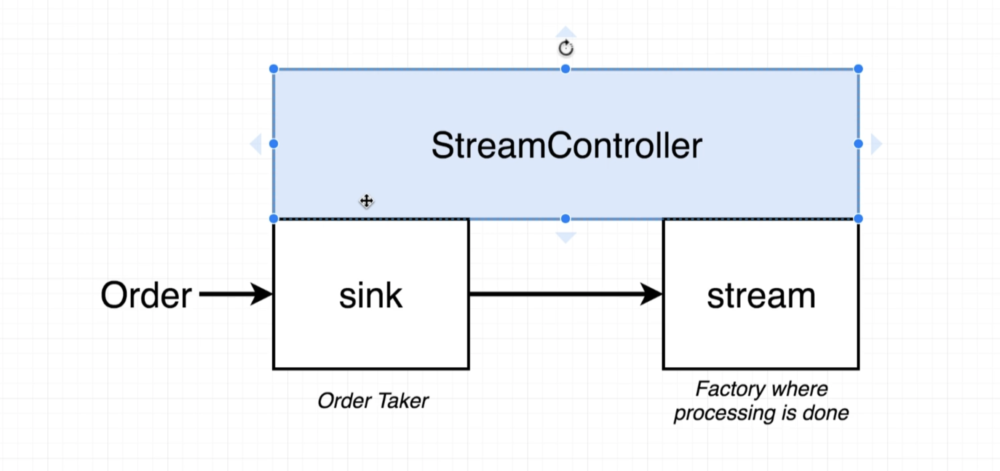
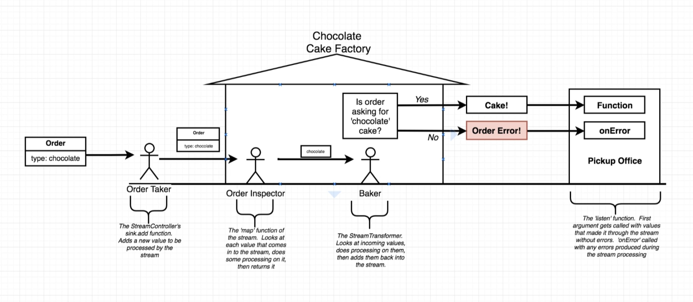

# Dart-Stream-Tutorial

# Streams by analogy





- What is stream? A source of asynchronous data events.

# Characteristics of a Cake Factory

- The factory receives an 'order', does some processing on it, then spits out a cake on the other end
- The factory isn't built when the order is made. The factory is made ahead of time.
- The factory spends a lot of time sitting around waiting for an order to come.
- Someone has to stand around waiting for an order to come in. This is the 'entry point' into the factory.

# Analogy by code

```dart
import 'dart:async';

class Cake {
  
}

class Order {
  String type; 
  Order(this.type);
}

void main() {
  final controller = new StreamController(); 
  final order = new Order('Banana');
  // add order 
  controller.sink.add(order);
  
  // receive order 
  controller.stream.map((order) => order.type);
}

```

# Adding handler

```dart
import 'dart:async';

class Cake {
  
}

class Order {
  String type; 
  Order(this.type);
}

void main() {
  final controller = new StreamController(); 
  final order = new Order('Banana');
  
  // order handler
  final baker = new StreamTransformer.fromHandlers(
    handleData: (cakeType, sink) {
      if(cakeType == 'chocolate') {
        sink.add(new Cake()); 
      } else {
        sink.addError('I cant bake that type!!!');
      }
    }
  );
  
  // add order 
  controller.sink.add(order);
  
  // receive order 
  controller.stream
    .map((order) => order.type)
    .transform(baker); //handler 
  
}
```

# Add Listener

```dart
import 'dart:async';

class Cake {
  
}

class Order {
  String type; 
  Order(this.type);
}

void main() {
  final controller = new StreamController(); 
  final bananaOrder = new Order('banana');
  final chocolateOrder = new Order('chocolate');
  
  // order handler
  final baker = new StreamTransformer.fromHandlers(
    handleData: (cakeType, sink) {
      if(cakeType == 'chocolate') {
        sink.add(new Cake()); 
      } else {
        sink.addError('I cant bake that type!!!');
      }
    }
  );
  
  // add order 
  controller.sink.add(bananaOrder);
  controller.sink.add(chocolateOrder);
  
  // receive order 
  controller.stream
    .map((order) => order.type)
    .transform(baker) // handler 
    .listen( // listener 
    (cake) => print('Here is your cake $cake'),
    onError: (err) => print(err),
  ); 
  
}
```

# Overview

- Order Take

⇒ The StreamController's sink.add function. Adds a new value to be processed by the stream

- Order Inspector

⇒ The 'map' function of the stream. Looks at each value that comes in to the stream, does some processing on it, the returns it. 

- Baker

⇒ The StreamTransformer. Looks at incoming values, does processing on them, then adds them back into the stream. 

- The 'listen' function. First argument gets called with values that made it through the stream without errors. 'onError' called with any errors produced during the stream processing.

# Process

1. Define Model with types
2. Create StreamTransformer in order to handle defines types 
3. Create stream (factory) which `1. returns types` , `2.  handle streams` , `3. listen to event handled by StreamTransformer`